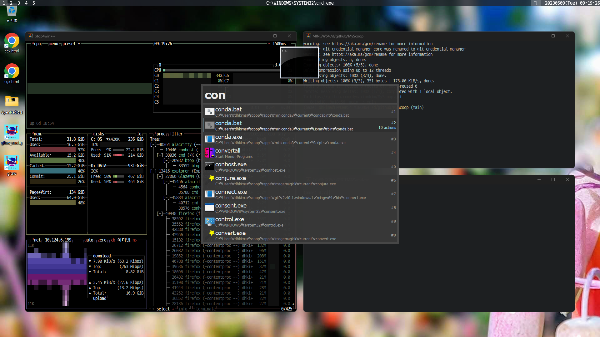

# MyScoop

_scoop configuration for my Windows PC_



## Conditions

### Recommended to install
* [git-fork](https://git-fork.com/) for git client
* [Bandizip](https://kr.bandisoft.com/bandizip/) for archives
* [eDrawings Viewer](https://www.edrawingsviewer.com/download-edrawings) for general
* [eDrawings Professional](https://www.edrawingsviewer.com/download-edrawings) for Solidworks users

### Recommended to uninstall
* before run myscoop.bat : git, git-lfs, gh, miniconda3, julia, everything
* before run myscoop_extend.bat : libreoffice, firefox, vscode, honyview ...

### Clone this repo:
* Use git-fork
* `mkdir D:\github`
* Clone `https://github.com/dymaxionkim/MyScoop.git` into `D:\github\MyScoop`


## Setting

### Manual Setting
* Read [myscoop_manual](myscoop_manual.md)

### Auto Setting

```cmd
cd D:\github\MyScoop
myscoop.bat
myscoop_extend.bat
```

## Maintenance

* Daily

```bash
scoop update
scoop update --all
conda update --all
```


